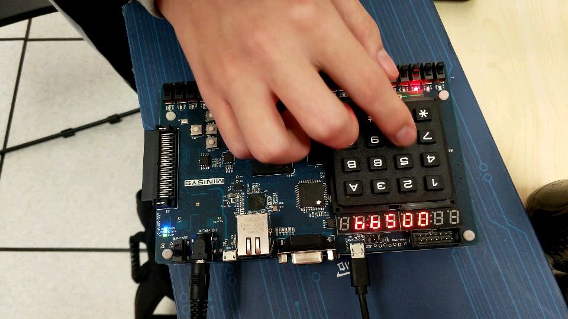

# CS207 Digital Design Project - Digital Clock

Our implementation of the CS207 task 1 and task 2 @ Fall 2018.

## Contributor

Nekonull: Main framework design, Clock, Countdown, Display, Alarm

JR Shen: Keyboard input and display, Countdown, Button jitter

Tert-butyllithium: Music, Paddling

## Task

Create a digital clock, with clock setting and alarm setting. Bonus for additional functions. All written in `verilog`.

## Modes

1. Clock: view, set clock time, set hourly alarm on/off
2. Stopwatch: start, pause, reset
3. Alarm: 4 alarm, each can set on/off, choose alarm music (3 songs in choice), set alarm length (15/30/45/60 sec), set alarm time.
4. Countdown: set time, start, pause, reset.

 ## Features

1. Intuitive and easy setting process with keyboard and buttons. (In 4 digit mode and 6 digit mode!)
2. All modes can work at the background simultaneously.
3. Global reset included, just in case.
4. All with great precision. (<1s error in 6h testing)
5. Major parts developed with test files.

## How to set up?

### Via Source Code

1. Clone the repo and import into `Vivado`
2. Set the `main.v` as top in `design source`.
3. Set the `clock_run.xdc` as target in `constraints`.
4. Generate bitstream and program into board.

### Via Bitstream File

Bitstream file is stored in `Releases` folder.

`main-working with debugs.bit`: All function working, with debug light.

`main_no_dbg-all pass check.bit`: All function working, without debug light.

## User Manual

1. 4 button, each for mode (S3/P5), set (S4/P4), change (S2/P1) and toggle (S5/P2).
2. Press `Mode` to cycle between different modes.
3. Press `Set` to enter setting in each mode, and to confirm after setting up.
4. Press `Change` to cycle between selections.
5. Press `Toggle` to start/stop countdown and stopwatch.
6. Other small settings:
   1. When `Alarm` is alarming, go to `Clock` and press `Toggle` to stop music playing.
   2. When `Countdown` is running, press `Change` to reset. When `Countdown` has finished and is buzzing, press `Toggle` to stop buzzing.

## Acknowledgements

1. Music Playing: https://www.cnblogs.com/kongtiao/archive/2011/07/20/2111581.html?tdsourcetag=s_pctim_aiomsg
2. Music Playing: https://www.fpga4fun.com/MusicBox.html
3. Binary to BCD: https://pubweb.eng.utah.edu/~nmcdonal/Tutorials/BCDTutorial/BCDConversion.html

More to be listed here...

## Final Words

This project took 32h with 3 people working in total approximately. It's quite a challenging journey. At first, we thought it would be impossible to finish this project, but at last we made it. Hope you enjoy too.

## Some Photos

### Clock

### Stopwatch

### Alarm

### Countdown

### Using Keyboard as Input

